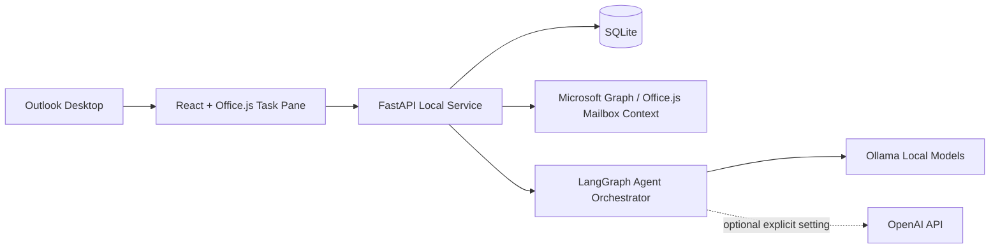

# AI Mailbox Manager for Outlook (Local-First)

AI Mailbox Manager is a production-oriented Outlook task-pane add-in and local Windows service that turns mailbox activity into prioritized work queues. It is designed around one professional workflow question: **What should I work on next?**

## Local-first principles

- Outlook data is processed on the user's Windows machine.
- SQLite is the only database and lives under the user's local app data folder by default.
- Ollama is the primary LLM provider; OpenAI is disabled unless explicitly configured by the user.
- The application never sends email automatically. Draft reply generation always requires user approval in Outlook.
- No telemetry, no cloud storage, and no Azure-hosted backend are required.

## Architecture

### Agents

- Email Classification Agent
- Task Extraction Agent
- Priority Scoring Agent
- Pendency Analysis Agent
- Reply Drafting Agent
- Productivity Analytics Agent

## Repository layout

- `backend/app` - FastAPI local API, SQLite models, mailbox sync services, LangGraph agents.
- `frontend/src` - React/TypeScript Outlook task pane using Fluent UI.
- `manifests/outlook-addin.xml` - Office add-in manifest.
- `installer/ai-mailbox-manager.iss` - Inno Setup Windows installer configuration.
- `docs/setup.md` - developer setup guide.
- `docs/deployment.md` - local desktop deployment guide.

## Quick start

See [`docs/setup.md`](docs/setup.md) and [`docs/deployment.md`](docs/deployment.md).
